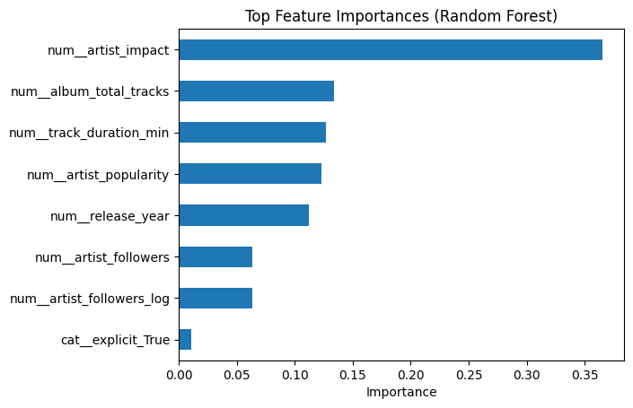

# STAT486-Final-Project

## Project Question & Motivation

This project investigates the question:

> **How accurately can we predict a song’s popularity using artist-level and track-level metadata, and what underlying groupings of songs can be identified through clustering?**

### Motivation

Understanding what drives song popularity is valuable for artists, producers, and music platforms. While some factors (like artist fame) are well known, it is less clear how much track-level characteristics (e.g., duration, album features) contribute.

This project aims to:

* Quantify how well popularity can be predicted using available metadata
* Compare the importance of artist-level vs. track-level features
* Identify natural groupings of songs using clustering

---

## Steps to Reproduce Results (Exact Run Order)

Follow these steps **in order**:

### 1. Set up environment

```bash
pip install -r requirements.txt
```

### 2. Add dataset

Download the dataset and place it in:

```
/data/spotify_data.csv
```

### 3. Run main analysis

Open and run:

```
notebooks/final_analysis.ipynb
```

Run all cells from top to bottom. This notebook reproduces:

* Data preprocessing
* Feature engineering (`artist_impact`)
* Model training and evaluation
* PCA analysis
* K-means clustering
* Visualizations and figures

---

## Main Results

### Model Performance

| Model             | RMSE      | R²        |
| ----------------- | --------- | --------- |
| Linear Regression | 20.73     | 0.277     |
| Ridge Regression  | 20.73     | 0.277     |
| Random Forest     | **18.85** | **0.402** |
| Gradient Boosting | 19.19     | 0.380     |
| SVR               | 20.79     | 0.273     |

**Random Forest performed best**, capturing nonlinear relationships in the data.

---

### Key Findings

* **Artist-level features are the strongest predictors of popularity**
* Engineered feature `artist_impact` dominates model importance
* Track-level features (duration, album size) have weaker effects
* Model performance is moderate due to:

  * High noise
  * Skewed popularity distribution



---

### Clustering Results (k = 3)

* **Cluster 0:** High artist impact → highest popularity
* **Cluster 1:** Low artist impact → lower popularity
* **Cluster 2:** Large albums → lowest popularity

Clustering reinforces that **artist influence is the primary driver** of success.

---

## Data Source & Usage

### Dataset

* **Spotify Global Music Dataset (2009–2025)**
  Source: Kaggle
  [https://www.kaggle.com/datasets/wardabilal/spotify-global-music-dataset-20092025](https://www.kaggle.com/datasets/wardabilal/spotify-global-music-dataset-20092025)

### Citation

Bilal, Warda. *Spotify Global Music Dataset (2009–2025)*. Kaggle.

### License / Usage Notes

* Dataset is publicly available for **educational and research use**
* Contains **no personally identifiable information (PII)**
* Data is aggregated at the track and artist level
* Results may reflect **Spotify platform biases** (e.g., promotion, algorithmic exposure)
