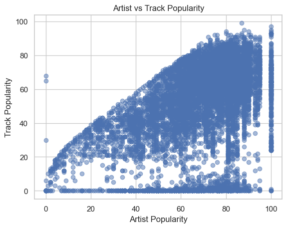
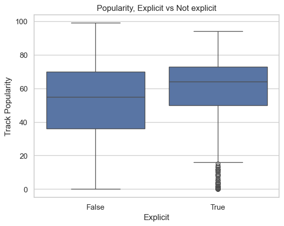

# Data and EDA Checkpoint

## 1. Research Question and Dataset Overview

Our research question is: **How do track-level and artist-level characteristics relate to a song’s popularity, and which features show the strongest relationships with track popularity?**

We use the Spotify Global Music Dataset (2009–2025), obtained from Kaggle:
https://www.kaggle.com/datasets/wardabilal/spotify-global-music-dataset-20092025

This dataset contains song-level and artist-level metadata for thousands of tracks, including information such as track popularity, artist popularity, number of followers, album details, and track duration. It provides a broad view of both musical content and artist reach.

The dataset is publicly available through Kaggle for research and educational use. It does not contain personally identifiable information (PII), and all data is aggregated at the track and artist level. Therefore, there are no major ethical or legal concerns associated with its use in this project.

---

## 2. Data Description and Variables

The primary target variable in this analysis is **`track_popularity`**, a continuous variable ranging from 0 to 100 that measures how popular a track is on Spotify.

Key explanatory variables include:
- `artist_popularity`: overall popularity of the artist
- `artist_followers`: number of followers the artist has
- `track_duration_min`: duration of the track in minutes
- `album_total_tracks`: number of tracks on the album
- `explicit`: binary indicator for explicit content

Additional metadata variables such as `track_name`, `artist_name`, `album_name`, and `album_release_date` provide context but are not directly used as numeric predictors in this stage of analysis.

No preprocessing was required for this dataset at this stage. The dataset was already clean, with no missing values or inconsistencies observed during initial inspection. Columns were well-formatted, and no duplicates or invalid entries were detected. Further preprocessing and feature engineering may be performed in later stages when building predictive models.

---

## 3. Summary Statistics

The dataset contains **8,582 observations** of songs.

Summary statistics for the target variable `track_popularity` are as follows:

- Mean: 52.36
- Standard Deviation: 23.82
- Minimum: 0
- 25th Percentile: 39
- Median: 58
- 75th Percentile: 71
- Maximum: 99

These statistics indicate that most songs fall within the mid-range of popularity, with a moderate spread across values. While the full range spans from 0 to 99, the interquartile range (39 to 71) suggests that extreme values are less common and most tracks cluster around moderate popularity levels.

For categorical variables, the `explicit` feature provides a binary classification of tracks. Approximately **75% of tracks are non-explicit**, while about **25% are explicit**, indicating that explicit content represents a smaller but still substantial portion of the dataset.

Preliminary exploration of relationships between variables shows that artist-level features, particularly `artist_popularity`, have the strongest association with track popularity. Correlation analysis indicates a moderate positive relationship, while features such as `artist_followers`, `track_duration_min`, and `album_total_tracks` exhibit weaker relationships.

Scatterplots further reveal that the relationship between artist popularity and track popularity is positive but exhibits increasing variability at higher values, suggesting a non-linear or heteroskedastic pattern. In contrast, track duration and album size show little to no visible relationship with popularity.

Overall, the data shows moderate variability and suggests that track popularity is influenced by a combination of factors rather than a single dominant predictor. These findings suggest that simple linear models may be insufficient, and more flexible approaches may be necessary.

---

## 4. Visual Exploration

What does it show?
- This scatterplot shows a fairly positive relationship between artist popularity and track popularity. As artist popularity increases, track popularity generally increases as well.

Why is it relevant?
- This provides strong evidence that artist-level characteristics are important predictors of track success. However, on a larger scale, especially at higher artist popularity, it shows that even very popular artists can produce both high and low-performing tracks. This suggests that artist popularity alone is not sufficient to fully explain track popularity.

What does it show?
- This boxplot compares the distribution of track popularity for explicit and non-explicit songs.

Why is it relevant?
- This helps evaluate whether explicit content influences popularity. The distributions appear fairly similar, though the explicit songs have a smaller spread and a slightly higher median. This suggests that explicit content is potentially a determinant of track popularity, meaning content type may significantly drive listener engagement.

---

## 5. Challenges and Reflection

One of the main challenges in this project was identifying a dataset that includes both track-level and artist-level variables in a clean and usable format. Many music datasets either focus only on audio features (such as tempo or energy) or only on artist metrics, making it difficult to study how these levels interact. 

That being said, we anticipated this kind of issue when tackling a project such as this and so we made sure we could find a dataset that would work for the research questions we had in mind. The selected Spotify dataset was valuable because it integrates both perspectives, but finding such a comprehensive dataset required careful searching and evaluation.

Another ongoing challenge is determining how to appropriately model the relationship between variables. Initial visualizations suggest that relationships—especially between artist popularity and track popularity—are non-linear and exhibit heteroskedasticity. This complicates the use of simple linear models and suggests that more flexible approaches (such as transformations or non-linear models) may be necessary.

Additionally, while some variables show moderate relationships, many features appear only weakly associated with track popularity. This raises the challenge of identifying which variables truly contribute meaningful predictive power versus those that add noise. Moving forward, feature selection and model evaluation will be important steps in refining the analysis.