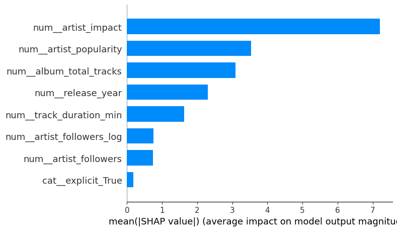

## 1) Problem Context and Research Question

The goal of this project is to predict Spotify track popularity using available track, artist, and album features. Specifically, we want to understand how well machine learning models can explain and predict variation in track popularity.

---

## 2) Supervised Models Implemented

We implemented several supervised learning models to compare performance across different approaches. All models were built using a preprocessing pipeline that handled missing values, scaled numeric features, and encoded categorical variables. We used an 80/20 train-test split, where model selection and hyperparameter tuning were performed using 5-fold cross-validation on the training set via GridSearchCV. Final performance was evaluated on the held-out test set using RMSE and R². RMSE was used to measure prediction error in the original popularity scale, while R² was used to assess the proportion of variance explained by each model.

| Model | Key Hyperparameters | Test RMSE | Test R² |
|------|--------------------|----------|--------|
| Linear Regression | None | 20.73 | 0.277 |
| Ridge Regression | alpha ∈ {0.01, 0.1, 1, 10, 100} | 20.73 | 0.277 |
| Random Forest | n_estimators, max_depth, min_samples_split, min_samples_leaf | **18.85** | **0.402** |
| Gradient Boosting | learning_rate, max_depth, max_iter | 19.19 | 0.380 |
| SVR | C, gamma | 20.79 | 0.273 |

---

## 3) Model Comparison and Selection

Across all models, ensemble methods performed noticeably better than linear models. Both Random Forest and Gradient Boosting were able to capture nonlinear relationships in the data, resulting in lower RMSE and higher R² values. Linear and Ridge regression performed nearly identically, suggesting that the relationship between features and track popularity is not well described by a simple linear model.

Random Forest performed best overall, achieving the lowest RMSE and highest R². This suggests that averaging many decision trees helped reduce variance and handle noisy patterns in the dataset.

One major challenge in this analysis was the distribution of the target variable. Track popularity is highly skewed, with a large spike of observations at or near zero. This creates a difficult prediction problem, since the model must simultaneously account for a large cluster of low-popularity tracks while still predicting variation among more popular tracks.

We considered filtering out low-popularity tracks to reduce this skew and potentially improve model performance. However, we ultimately decided to keep these observations because they represent a meaningful portion of the dataset and reflect real-world conditions where many songs receive little attention. Removing them may have simplified the modeling task, but it would also reduce the realism of the problem. That said, there is still some uncertainty in this decision, as filtering could potentially improve predictive accuracy at the cost of generalizability.

Additional hyperparameter tuning resulted in only minor improvements, indicating that model performance is likely limited more by the structure and noise in the data than by model configuration.

---

## 4) Explainability and Interpretability

To better understand model behavior, we examined feature importance from the Random Forest model. The most important feature by a large margin was artist_impact, which is a feature we engineered as a combination of artist popularity and follower count. This suggests that a strong interaction between an artist’s reach and recognition plays the biggest role in predicting track popularity.

After that, features such as album_total_tracks, track_duration_min, artist_popularity, and release_year all contributed moderately to the model. Interestingly, artist_followers and artist_followers_log were less important on their own, likely because their effect is already captured within the artist_impact feature.

The explicit indicator had almost no importance, suggesting that whether a song is explicit does not meaningfully impact popularity in this dataset.

To further interpret model behavior, we used SHAP (SHapley Additive exPlanations) values on the Random Forest model. The SHAP summary plot confirmed that artist_impact was the most influential feature, consistently contributing positively to higher predicted popularity. Artist popularity and then album characteristics followed, showing smaller, mixed effects depending on their values. This analysis reinforces that artist-level features dominate predictions, while track-level features provide more nuanced contributions.

Overall, these results align with intuition. Artist-level influence appears to dominate, while track-level characteristics provide additional but smaller predictive value.

---

## 5) Final Takeaways

Overall, Random Forest provided the best performance for predicting track popularity, outperforming both linear and other nonlinear models. The results suggest that while some structure exists in the data, a large portion of variability remains unexplained.

The skewed distribution of track popularity, especially the concentration of values near zero, plays a major role in limiting model performance. This highlights the difficulty of predicting outcomes in datasets where the target variable is highly imbalanced or noisy.

This analysis answers the research question by showing that machine learning models can moderately predict track popularity, but their performance is constrained by the nature of the data. Future improvements would likely require additional features such as user engagement metrics, playlist placement, or temporal trends.
