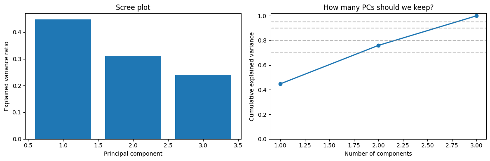
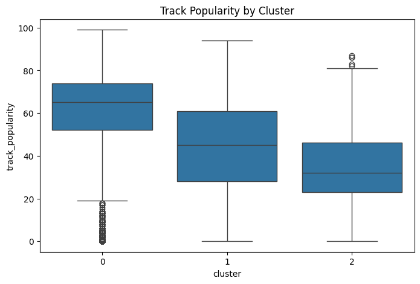

## Additional Machine Learning Method: PCA

We were curious if PCA would corroborate our results from SHAP. Despite not having many total features, we can still take note of any features we plan on using in the model that don't influence the most important PCs, and consider removing them in future analyses. 

Before running the PCA, we standardized the features we planned to use in the model, since we do not want features with higher numbers to have an outsized influence on our results.

After running the PCA, the two most important principal components accounted for approximately 76% of the variance. If one of our features does not significantly contribute to either of these components, then we can reasonably say that it is less useful in explaining variance in the response variable.

All the features in our current model seemed to contribute significantly to the 2 most important principal components. This tells us that those features are able to explain a significant portion of the variance in the response variable, and PCA does not support removing any of them in future analyses.

### Principal Component 1
|--------| Loading | Abs Loading
|--------|---------|-------------|
| Album Tracks | 0.670 | 0.670
| Duration | 0.553 | 0.553 |
| Artist Impact | 0.496 | 0.496

### Principal Component 2
|--------| Loading | Abs Loading
|--------|---------|-------------|
| Artist Impact | 0.766 | 0.670
| Duration | -0.641 | 0.641 |
| Album Tracks | -0.037 | 0.037|

## Additional Machine Learning Method: Clustering

We applied k-means clustering to identify natural groupings of songs based on artist- and track-level characteristics. This method fits our research question because it allows us to explore structure in the data beyond just predicting popularity.

For clustering, we selected the features `artist_impact`, `track_duration_min`, and `album_total_tracks`. The `artist_impact` feature was engineered as a combination of artist popularity and follower count and was the most important predictor in our supervised models, and was a significant contributor in the most important PCs in our PCA analysis. Including it here allows us to directly examine how artist-level influence shapes groups of songs.

We did not include both `artist_popularity` and `artist_followers` separately because they are highly correlated and already captured within `artist_impact`. Using redundant features can negatively affect K-means since it relies on distance calculations.

The additional features, `track_duration_min` and `album_total_tracks`, were included to provide variation beyond artist influence. These represent track-level and album-level characteristics and help ensure that clusters are not based solely on artist strength.

All features were standardized before clustering to ensure that each variable contributed equally. We evaluated different values of k using both the elbow method and silhouette scores. The elbow plot suggested a value around 3–4, while the highest silhouette score occurred at k = 3. Based on this, we selected k = 3 as a balance between cluster quality and interpretability.

### Cluster Summary

| Cluster | Artist Impact | Duration | Album Tracks | Avg Popularity |
|--------|-------------|---------|--------------|----------------|
| 0 | 1357.34 | 3.88 | 14.12 | 59.65 |
| 1 | 655.42 | 2.89 | 8.51 | 42.41 |
| 2 | 1016.05 | 3.22 | 52.55 | 34.24 |

Cluster sizes:
- Cluster 0: 5129 songs
- Cluster 1: 3077 songs
- Cluster 2: 376 songs

The resulting clusters showed clear and interpretable patterns. One cluster consisted of songs from high-impact artists and had the highest average popularity. Another cluster contained lower-impact artists with lower popularity. A third cluster was characterized by larger albums and moderate artist impact, but had the lowest average popularity.

These results reinforce our supervised findings that artist-level influence is the dominant driver of track popularity, while also revealing additional structure related to album characteristics.
